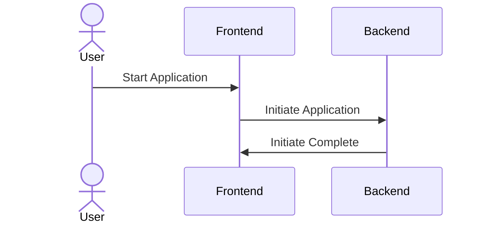
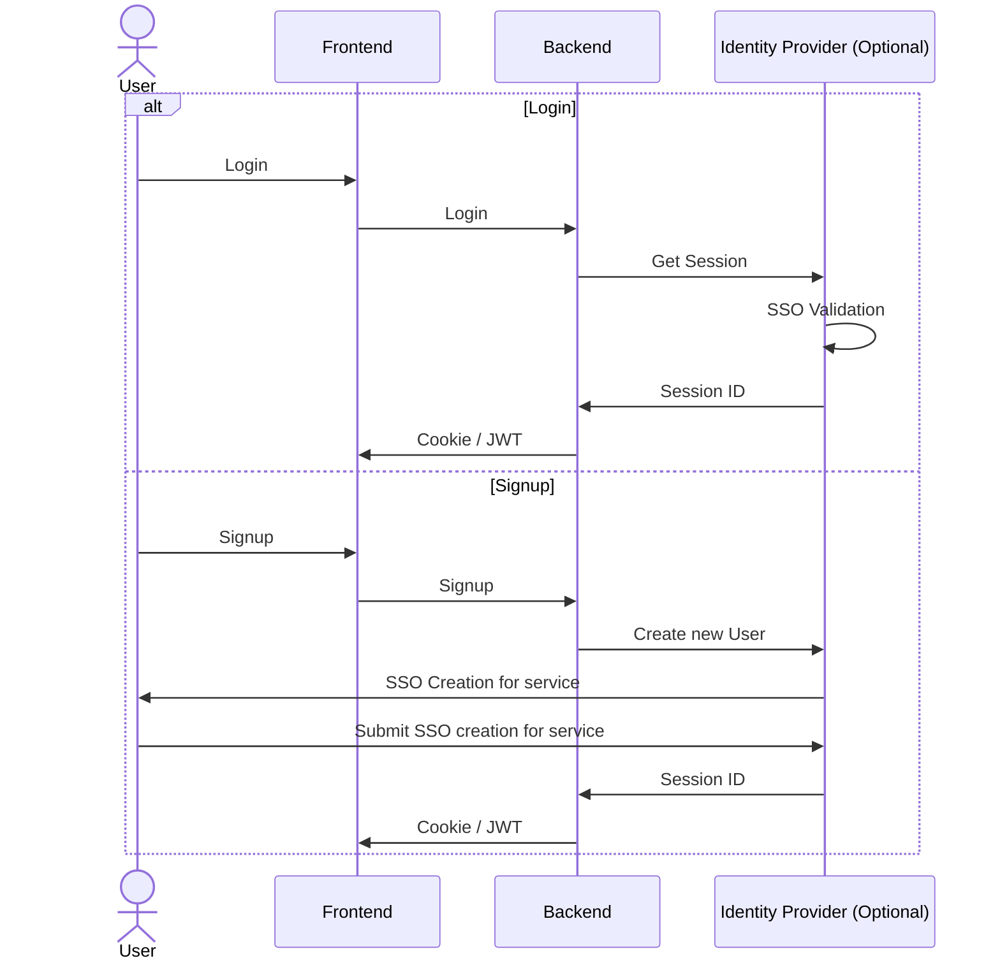
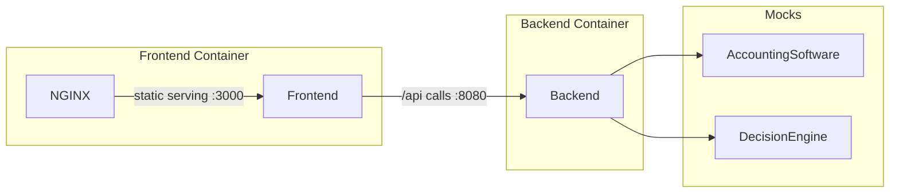

# demyst-code-kata
_Demyst_ Home Assignment for **Senior/Principal Software Engineer** role - Code Kata - for "Loan System" exercise

See supersize reference here: https://github.com/DemystData/code-kata

## Author
**Idan Izicovich** <idanizi@gmail.com>
- 🌍 Website: <https://idanizi.com>
- 🔗 LinkedIn: <https://www.linkedin.com/in/idanizi/>
- ☎️ Phone: [\+972 545921327](tel:972545921327)

## Special Notes For Reviewers:
Hello there 👋, I hope you'd like this implementation of your code-kata.
For any questions of "How to run" etc. - please don't hesitate to give me a call/email.

### Note: **"Start Application Flow"**
I understand for the simplicity of the submission you wanted the
candidates to avoid having a "Login" flow, so instead:



Usually you would expect:



So I appreciate that you didn't require to implement that. Though I wanted to let you
know that I have experience in implementing this kind of flow, in different complexity
levels.

For the sake of this simplicity of this home assignment - I will do it exactly as
you required.

## Getting Started:

### Prerequisites:
- Node v18.16.0+ (using nvm is recommended)
- pnpm
  - If not installed: `npm i -g pnpm`

## Development:

Both frontend and backend work with pnpm:
1. open 2 terminal sessions for `frontend/` and `backend/` folders
2. at each folder run the command:
```shell
pnpm dev
```

By default, backend will run on port `8080`
and frontend will run on port `3000`.

### Debugging:

#### Backend:
Sourcemap is supported in development using nodemon.
When running at production mode sourcemaps is being loaded as well - 
so any errors that occur during run are being logged and mapped to their
typescript source-code reference.

Per IDEs:
- [Debugging using VS-CODE](https://code.visualstudio.com/docs/typescript/typescript-debugging)
- [Debugging using Webstorm](https://www.jetbrains.com/help/webstorm/running-and-debugging-typescript.html)

#### Frontend:
Look at DevTools of your favourite browser (Google Chrome is recommended)
for logs of errors and warnings. On dev mode - immediate errors will be presented in
a crash page in the browser. Hot-Module-Reloading (HMR) is supported.

---

## Production:

### Natively on Linux/MacOS machines:
1. Make sure all prerequisites installed on the production machine
2. `cd backend && pnpm start`
3. `cd frontend && pnpm build && pnpx serve -p 3000 ./dist`

> Note: `serve` is not high performance static server engine. Is recommended to use
> hi-performance one like NGINX or other with load-balancer in case your planing
> to go hi-scale with it.

### Using Docker:
1. Make sure you have docker installed
2. `docker-compose up`

## Tech-stack, Architecture & Design:
Classic Typescript-NoteJS + Express + React tech-stack:
- Frontend:
  - Bundler: Vite ⚡️
  - Framework: React ⚛️
  - Lang: Typescript 
  - Styling: Scss 🎨
  - Tests: Jest ⚡️ + React Testing Library 🐙
- Backend:
  - Framework: Express
  - Lang: Typescript
  - Tests: Jets + Supertest

